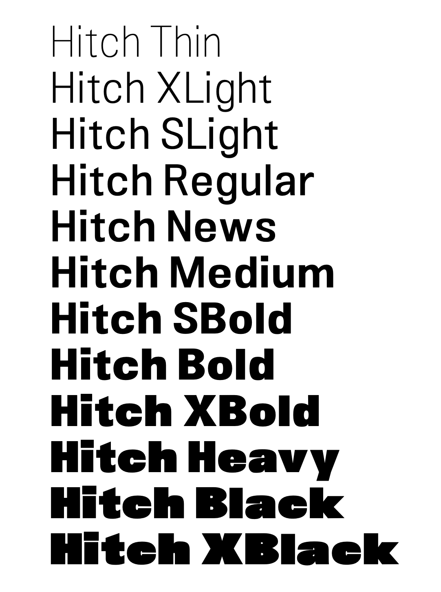

# Download
Font can be downloaded under [releases](https://github.com/akkurat/hitch-grotesk/releases "Go to Releases")

To Play with the font (and variable fonts) I recomend <https://www.axis-praxis.org/>

# Hitch Font
Neo Grotesque Font

* Extra Condensed Styles
* Thin Styles
* Extra Black Styles
* Multi Master

# Edit
* This font was created using Fontlab
* Bugs can be reported agnostic (with images or description)
* Improvements can be done in any software editing the MM ttf (and probably need to be merged manually back into fontlab format)

# Licence
Hitch Grotesk is licensed under the SIL Open Font License v1.1 (<http://scripts.sil.org/OFL>)
To view the copyright and specific terms and conditions please refer to [OFL.txt](/OFL.txt)

